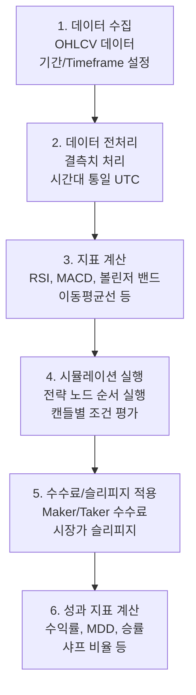
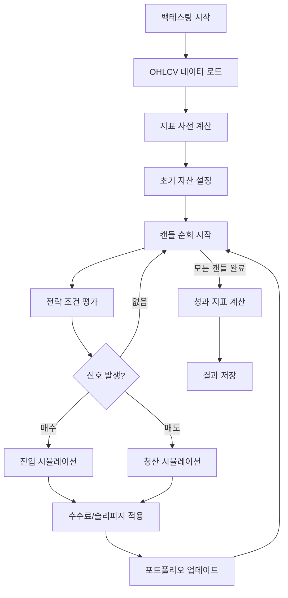

# 백테스팅 (Backtesting)

## 1. 개요

백테스팅은 과거 시장 데이터를 기반으로 전략의 성과를 시뮬레이션하는 기능입니다.

## 2. 백테스팅 파이프라인



### 2.1 데이터 수집

| 파라미터 | 타입 | 설명 | 예시 |
|---------|------|------|------|
| `symbol` | str | 거래쌍 | `BTC/USDT` |
| `timeframe` | str | 캔들 간격 | `1h`, `4h`, `1d` |
| `start_date` | date | 시작일 | `2024-01-01` |
| `end_date` | date | 종료일 | `2024-12-31` |

### 2.2 데이터 전처리

**결측치 처리**:
- `ffill` (Forward Fill): 이전 값으로 채우기
- `bfill` (Backward Fill): 이후 값으로 채우기
- `drop`: 결측치가 있는 행 삭제

**시간대 통일**: 모든 타임스탬프를 UTC로 변환

### 2.3 지표 계산

기술적 지표를 사전 계산하여 시뮬레이션 속도 향상:
- **RSI**: 상대강도지수
- **MACD**: 이동평균 수렴확산
- **볼린저 밴드**: 변동성 밴드
- **이동평균선**: SMA, EMA

## 3. 성과 지표 (Performance Metrics)

### 3.1 수익성 지표

| 지표 | 설명 | 수식 |
|------|------|------|
| **총 수익률 (Total Return)** | 전체 기간 수익률 | `R = (V_f - V_0) / V_0` |
| **연간 수익률 (CAGR)** | 연평균 성장률 | `CAGR = (V_f / V_0)^(1/n) - 1` |
| **평균 수익 (Avg Profit)** | 평균 수익 거래 수익 | `μ_profit = Σ_profit / N_profit` |
| **평균 손실 (Avg Loss)** | 평균 손실 거래 손실 | `μ_loss = Σ_loss / N_loss` |

**변수**:
- `V_0`: 초기 자산 (Initial Capital)
- `V_f`: 최종 자산 (Final Value)
- `n`: 연도 수
- `Σ_profit`: 총 수익
- `N_profit`: 수익 거래수
- `Σ_loss`: 총 손실
- `N_loss`: 손실 거래수

### 3.2 리스크 지표

| 지표 | 설명 | 수식 |
|------|------|------|
| **MDD (Maximum Drawdown)** | 최대 낙폭 | `MDD = max((H_t - L_t) / H_t)` |
| **변동성 (Volatility)** | 수익률 표준편차 | `σ = sqrt(Σ(R_i - R̄)^2 / (n-1))` |
| **칼마 비율 (Calmar Ratio)** | 수익/MDD 비율 | `Calmar = CAGR / MDD` |

**변수**:
- `H_t`: 시점 t까지의 고점 (Peak)
- `L_t`: 시점 t의 저점 (Trough)
- `R_i`: i번째 기간 수익률
- `R̄`: 평균 수익률

### 3.3 효율성 지표

| 지표 | 설명 | 수식 |
|------|------|------|
| **샤프 비율 (Sharpe Ratio)** | 위험 조정 수익률 | `Sharpe = (R̄ - R_f) / σ` |
| **승률 (Win Rate)** | 수익 거래 비율 | `WR = N_profit / N_total` |
| **손익비 (Profit Factor)** | 수익/손실 비율 | `PF = Σ_profit / \|Σ_loss\|` |
| **기대값 (Expected Value)** | 평균 거래 수익 | `EV = (WR × μ_profit) - ((1-WR) × \|μ_loss\|)` |

**변수**:
- `R_f`: 무위험 이자율 (Risk-free Rate)
- `N_total`: 전체 거래수

### 3.4 거래 통계

| 지표 | 설명 |
|------|------|
| **총 거래 횟수** | 매수 + 매도 횟수 |
| **평균 보유 기간** | 매수~매도 평균 시간 |
| **최대 연속 승/패** | 연속 수익/손실 최대 횟수 |
| **Profit Factor** | 총 수익 / 총 손실 절대값 |

## 4. 시뮬레이션 엔진 (Simulation Engine)

### 4.1 실행 흐름



### 4.2 주문 실행 모델

**시장가 주문 (Market Order)**:
```
실행 가격 = 시가 + 슬리피지
```

**지정가 주문 (Limit Order)**:
```
- 캔들 고점 ≥ 지정가: 체결 (캔들 저점~지정가 사이 랜덤)
- 캔들 고점 < 지정가: 미체결
```

**조건부 주문 (Stop/Limit)**:
```
- 스탑 로스: 지정가 터치 시 시장가로 체결
- 테이크 프로핏: 지정가 도달 시 지정가로 체결
```

### 4.3 수수료 및 슬리피지

**수수료 (Commission)**:
```
Maker Fee: 0.1% (지정가 주문, 유동성 공급)
Taker Fee: 0.1% (시장가 주문, 유동ity 소비)
```

**슬리피지 (Slippage)**:
```
시장가 주문: 0.05% ~ 0.1%
지정가 주문: 0%
```

**실제 실행 가격 계산**:
```
매수: price = current_price × (1 + slippage) + commission
매도: price = current_price × (1 - slippage) - commission
```

### 4.4 포트폴리오 관리

**자산 추적**:
```python
Portfolio = {
    "cash": 10000,        # 현금 (USDT)
    "holdings": {         # 보유 자산
        "BTC": 0.5
    },
    "total_value": 0,     # 총 자산 가치
    "positions": []       # 진입 포지션 리스트
}
```

**포지션 관리**:
```python
Position = {
    "symbol": "BTC/USDT",
    "side": "long",       # long or short
    "entry_price": 50000,
    "quantity": 0.1,
    "entry_time": "2024-01-01T00:00:00Z",
    "exit_price": None,
    "exit_time": None,
    "pnl": 0              # realized PnL
}
```

---

## 5. 데이터 소스

### 5.1 거래소 데이터
- **Binance**: 무료 API, 가장 풍부한 데이터
- **Upbit/바이비트**: 한국 시장 지원 시 추가

### 5.2 데이터 저장
```sql
CREATE TABLE ohlcv_data (
  id SERIAL PRIMARY KEY,
  symbol VARCHAR(20),      -- BTC/USDT
  timeframe VARCHAR(10),    -- 1h, 4h, 1d
  timestamp TIMESTAMPTZ,
  open DECIMAL,
  high DECIMAL,
  low DECIMAL,
  close DECIMAL,
  volume DECIMAL,
  UNIQUE(symbol, timeframe, timestamp)
);

-- 인덱스
CREATE INDEX idx_ohlcv_symbol_time ON ohlcv_data(symbol, timeframe, timestamp);
```

## 5. 백테스팅 실행

### 5.1 API
```http
POST /api/v1/backtests
{
  "strategy_id": "uuid",
  "symbol": "BTC/USDT",
  "timeframe": "1h",
  "start_date": "2024-01-01",
  "end_date": "2024-12-31",
  "initial_capital": 10000,
  "commission_rate": 0.001  -- 0.1%
}

← 202 Accepted
{
  "backtest_id": "uuid",
  "status": "QUEUED"
}
```

### 5.2 비동기 실행
```python
# FastAPI Background Task
@router.post("/backtests")
async def create_backtest(
    request: BacktestRequest,
    background_tasks: BackgroundTasks
):
    backtest_id = uuid4()
    background_tasks.add_task(
        run_backtest,
        backtest_id,
        request
    )
    return {"backtest_id": backtest_id, "status": "QUEUED"}
```

### 5.3 진행률 조회
```http
GET /api/v1/backtests/{id}
← 200 OK
{
  "id": "uuid",
  "status": "RUNNING",  # QUEUED, RUNNING, COMPLETED, FAILED
  "progress": 45,       # %
  "result": null        # 완료 시 결과 포함
}
```

## 6. 결과 시각화

### 6.1 차트
- **자산 곡선**: 시간별 자산 변화
- **드로다운 차트**: MDD 시각화
- **거래 마커**: 매수/매도 지점 표시

### 6.2 테이블
- **거래 내역**: 모든 매수/매도 기록
- **월별 수익률**: 월간 성과 집계

## 7. 파라미터 최적화 (Parameter Optimization)

### 7.1 그리드 서치 (Grid Search)

모든 파라미터 조합을 시도하여 최적값 찾기.

**예시: RSI 전략**
| 파라미터 | 검색 범위 |
|---------|----------|
| `rsi_period` | [10, 14, 20, 30] |
| `oversold` | [20, 25, 30] |
| `overbought` | [70, 75, 80] |

**총 조합 수**: 4 × 3 × 3 = 36회 백테스팅

**장점**:
- 모든 조합 탐색으로 전역 최적값 보장
- 병렬 처리 용이

**단점**:
- 파라미터 수가 많으면 계산 비용 기하급수적 증가
- 차원의 저주 문제

### 7.2 무작위 서치 (Random Search)

랜덤하게 파라미터 조합 선택.

**장점**:
- 그리드 서치보다 적은 횟수로 좋은 결과 도달 가능
- 연속형 파라미터에 효과적

**단점**:
- 최적값 보장 없음
- 결과 재현성 낮음

### 7.3 베이지안 최적화 (Bayesian Optimization)

이전 결과를 학습하여 다음 파라미터 제안.

**알고리즘**: TPE (Tree-structured Parzen Estimator), GP (Gaussian Process)

**장점**:
- 적은 횟수로 최적값 근접
- 계산 비용 절감

**단점**:
- 구현 복잡
- 하이퍼파라미터 튜닝 필요

### 7.4 유전자 알고리즘 (Genetic Algorithm)

진화 과정 모방하여 최적 파라미터 탐색.

**과정**:
```
1. 초기 population 생성 (랜덤 파라미터 세트)
2. fitness 평가 (백테스팅 수익률)
3. selection (상위 성과 개체 선택)
4. crossover (부모 세트 교배)
5. mutation (랜덤 변이)
6. 반복
```

**파라미터**:
- `population_size`: 50~100
- `generations`: 10~20
- `mutation_rate`: 0.01~0.1

### 7.5 Walk-Forward 분석

과최적화(Overfitting) 방지를 위한 검증 방법.

**과정**:
```
1. In-Sample 기간: 파라미터 최적화
   (예: 2024-01 ~ 2024-06)

2. Out-of-Sample 기간: 최적 파라미터 테스트
   (예: 2024-07 ~ 2024-09)

3. 윈도 이동 후 반복
```

**성과 평가**:
- In-Sample 수익률 vs Out-of-Sample 수익률 차이
- 차이가 클수록 Overfitting 의심

---

## 8. 관련 문서 가이드

이 문서를 읽은 후, 작업하려는 내용에 따라 다음 specs 문서를 참고하세요:

| 작업 내용 | 참조할 specs 문서 |
|-----------|------------------|
| **OHLCV 데이터 수집/처리** | `specs/data-processing.md` |
| **기술적 지표 계산** | `specs/indicators.md` (RSI, MACD 등) |
| **시뮬레이션 엔진 구현** | `specs/simulation.md` |
| **성과 지표 계산** | `specs/performance-metrics.md` |
| **수수료/슬리피지 모델** | `specs/commission-slippage.md` |

### 다른 도메인과의 연계

| 연계 작업 | 참조할 도메인 |
|-----------|--------------|
| **전략 정의 읽기** | [../03-strategy/index.md](../03-strategy/index.md) |
| **백테스트 결과 온체인 기록** | [../05-blockchain/index.md](../05-blockchain/index.md) |
| **backtests 테이블** | [../06-data/index.md](../06-data/index.md) |

---

*최종 업데이트: 2025-12-29*
