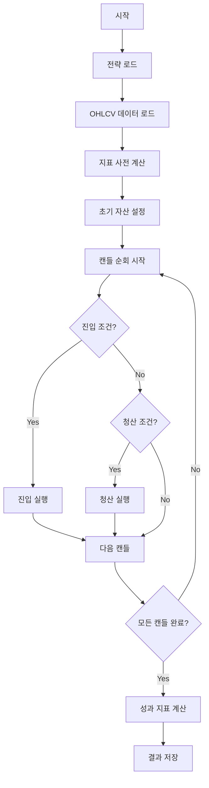

# 시뮬레이션 엔진 (Simulation Engine)

백테스팅 시뮬레이션 실행 엔진 상세 명세입니다.

---

## 1. 시뮬레이션 개요

### 1.1 실행 흐름



---

## 2. 포트폴리오 관리

### 2.1 Portfolio 클래스

```python
from typing import Dict, List, Optional
from dataclasses import dataclass, field
from datetime import datetime
from decimal import Decimal

@dataclass
class Position:
    """포지션 정보"""
    symbol: str
    side: str  # 'long' or 'short'
    entry_price: Decimal
    quantity: Decimal
    entry_time: datetime
    exit_price: Optional[Decimal] = None
    exit_time: Optional[datetime] = None
    pnl: Optional[Decimal] = None

    @property
    def is_open(self) -> bool:
        return self.exit_price is None

    @property
    def unrealized_pnl(self, current_price: Decimal) -> Decimal:
        """미실현 손익"""
        if self.side == 'long':
            return (current_price - self.entry_price) * self.quantity
        else:
            return (self.entry_price - current_price) * self.quantity

@dataclass
class Portfolio:
    """포트폴리오"""
    cash: Decimal = field(default_factory=lambda: Decimal('10000'))
    holdings: Dict[str, Decimal] = field(default_factory=dict)
    positions: List[Position] = field(default_factory=list)

    @property
    def total_value(self, current_prices: Dict[str, Decimal]) -> Decimal:
        """총 자산 가치"""
        total = self.cash

        for symbol, quantity in self.holdings.items():
            price = current_prices.get(symbol, Decimal('0'))
            total += price * quantity

        return total

    def add_position(self, position: Position):
        """포지션 추가"""
        self.positions.append(position)

        # 보유 자산 업데이트
        if position.is_open:
            if position.side == 'long':
                self.holdings[position.symbol] = (
                    self.holdings.get(position.symbol, Decimal('0')) + position.quantity
                )
            else:  # short
                self.holdings[position.symbol] = (
                    self.holdings.get(position.symbol, Decimal('0')) - position.quantity
                )

    def close_position(
        self,
        position: Position,
        exit_price: Decimal,
        exit_time: datetime
    ) -> Decimal:
        """포지션 청산"""
        position.exit_price = exit_price
        position.exit_time = exit_time

        # 실현 손익 계산
        if position.side == 'long':
            pnl = (exit_price - position.entry_price) * position.quantity
        else:
            pnl = (position.entry_price - exit_price) * position.quantity

        position.pnl = pnl

        # 현금 업데이트
        self.cash += (exit_price * position.quantity) + pnl

        # 보유 자산 업데이트
        if position.side == 'long':
            self.holdings[position.symbol] -= position.quantity
        else:
            self.holdings[position.symbol] += position.quantity

        return pnl
```

---

## 3. 주문 실행 시뮬레이션

### 3.1 Order Executor

```python
from enum import Enum
from typing import Literal

class OrderType(str, Enum):
    MARKET = "market"
    LIMIT = "limit"
    STOP_MARKET = "stop_market"
    STOP_LIMIT = "stop_limit"

class OrderSide(str, Enum):
    BUY = "buy"
    SELL = "sell"

class OrderExecutor:
    """주문 실행 시뮬레이터"""

    def __init__(
        self,
        commission_rate: float = 0.001,  # 0.1%
        slippage_rate: float = 0.0005,   # 0.05%
    ):
        self.commission_rate = commission_rate
        self.slippage_rate = slippage_rate

    def execute_market_order(
        self,
        side: OrderSide,
        quantity: Decimal,
        current_price: Decimal,
        current_candle: dict
    ) -> dict:
        """
        시장가 주문 실행

        Returns:
            {
                'executed': bool,
                'price': Decimal,
                'quantity': Decimal,
                'commission': Decimal,
                'slippage': Decimal
            }
        """
        # 슬리피지 적용
        if side == OrderSide.BUY:
            slippage_price = current_price * (1 + self.slippage_rate)
        else:
            slippage_price = current_price * (1 - self.slippage_rate)

        # 수수료 계산
        notional = slippage_price * quantity
        commission = notional * self.commission_rate

        return {
            'executed': True,
            'price': slippage_price,
            'quantity': quantity,
            'commission': commission,
            'slippage': slippage_price - current_price
        }

    def execute_limit_order(
        self,
        side: OrderSide,
        limit_price: Decimal,
        quantity: Decimal,
        candle: dict
    ) -> dict:
        """
        지정가 주문 실행

        체결 조건:
        - 매수: 캔들 저점 <= 지정가
        - 매도: 캔들 고점 >= 지정가
        """
        low = Decimal(str(candle['low']))
        high = Decimal(str(candle['high']))

        if side == OrderSide.BUY:
            if low <= limit_price <= high:
                # 체결 (저점~지정가 사이 랜덤)
                executed_price = max(low, limit_price)
                notional = executed_price * quantity
                commission = notional * self.commission_rate

                return {
                    'executed': True,
                    'price': executed_price,
                    'quantity': quantity,
                    'commission': commission
                }
        else:  # SELL
            if high >= limit_price >= low:
                # 체결 (지정가~고점 사이 랜덤)
                executed_price = min(high, limit_price)
                notional = executed_price * quantity
                commission = notional * self.commission_rate

                return {
                    'executed': True,
                    'price': executed_price,
                    'quantity': quantity,
                    'commission': commission
                }

        # 미체결
        return {'executed': False}

    def execute_stop_loss(
        self,
        side: OrderSide,
        stop_price: Decimal,
        quantity: Decimal,
        current_price: Decimal
    ) -> dict:
        """
        스탑 로스 주문 실행

        트리거: 가격이 stop_price에 도달하면 시장가로 체결
        """
        if side == OrderSide.LONG:
            # Long 포지션: 가격 하락 시 stop
            if current_price <= stop_price:
                return self.execute_market_order(
                    OrderSide.SELL,
                    quantity,
                    current_price,
                    {}
                )
        else:  # SHORT
            # Short 포지션: 가격 상승 시 stop
            if current_price >= stop_price:
                return self.execute_market_order(
                    OrderSide.BUY,
                    quantity,
                    current_price,
                    {}
                )

        return {'executed': False}
```

---

## 4. 백테스팅 엔진

### 4.1 Backtester 클래스

```python
import asyncio
from typing import Callable, Any
from app.models.strategy import Strategy

class Backtester:
    """백테스팅 엔진"""

    def __init__(
        self,
        initial_capital: float = 10000,
        commission_rate: float = 0.001,
        slippage_rate: float = 0.0005
    ):
        self.initial_capital = Decimal(str(initial_capital))
        self.portfolio = Portfolio(cash=self.initial_capital)
        self.executor = OrderExecutor(commission_rate, slippage_rate)
        self.trades: List[dict] = []
        self.equity_curve: List[dict] = []

    async def run(
        self,
        strategy_definition: dict,
        ohlcv_data: List[dict],
        indicators_data: dict
    ) -> dict:
        """
        백테스팅 실행

        Args:
            strategy_definition: 전략 노드-엣지 정의
            ohlcv_data: OHLCV 데이터
            indicators_data: 사전 계산된 지표 데이터

        Returns:
            백테스팅 결과
        """
        # 1. 전략 로드
        from app.services.execution_engine import ExecutionEngine
        engine = ExecutionEngine(None, None, None)

        # 2. 캔들 순회
        for i, candle in enumerate(ohlcv_data):
            # 현재 가격
            current_price = Decimal(str(candle['close']))

            # 3. 전략 조건 평가
            signals = await engine.evaluate_signals(
                strategy=strategy_definition,
                candle=candle,
                indicators={
                    k: v[i] if i < len(v) else None
                    for k, v in indicators_data.items()
                },
                portfolio=self.portfolio
            )

            # 4. 진입 신호 처리
            if signals.get('buy'):
                await self._execute_buy(current_price, candle, signals['buy'])

            # 5. 청산 신호 처리
            if signals.get('sell'):
                await self._execute_sell(current_price, candle, signals['sell'])

            # 6. Stop Loss / Take Profit 확인
            await self._check_stop_orders(current_price, candle)

            # 7. 자산 기록
            self._record_equity(candle, current_price)

        # 8. 성과 지표 계산
        return self._calculate_results()

    async def _execute_buy(
        self,
        price: Decimal,
        candle: dict,
        signal_config: dict
    ):
        """매수 실행"""
        # 수량 계산
        amount = Decimal(str(signal_config.get('amount', 1000)))
        amount_unit = signal_config.get('amount_unit', 'USDT')

        if amount_unit == 'USDT':
            quantity = amount / price
        else:  # base coin
            quantity = amount

        # 주문 실행
        result = self.executor.execute_market_order(
            OrderSide.BUY,
            quantity,
            price,
            candle
        )

        if result['executed']:
            # 포지션 생성
            position = Position(
                symbol=candle.get('symbol', 'BTC/USDT'),
                side='long',
                entry_price=result['price'],
                quantity=result['quantity'],
                entry_time=datetime.utcnow()
            )

            self.portfolio.add_position(position)

            # 거래 기록
            self.trades.append({
                'timestamp': candle['timestamp'],
                'side': 'buy',
                'price': float(result['price']),
                'quantity': float(result['quantity']),
                'commission': float(result['commission']),
                'type': 'market'
            })

    async def _execute_sell(
        self,
        price: Decimal,
        candle: dict,
        signal_config: dict
    ):
        """매도 실행 (포지션 청산)"""
        # 진입 포지션 찾기
        open_positions = [p for p in self.portfolio.positions if p.is_open]

        if not open_positions:
            return

        for position in open_positions:
            # 주문 실행
            result = self.executor.execute_market_order(
                OrderSide.SELL,
                position.quantity,
                price,
                candle
            )

            if result['executed']:
                # 포지션 청산
                pnl = self.portfolio.close_position(
                    position,
                    result['price'],
                    datetime.utcnow()
                )

                # 거래 기록
                self.trades.append({
                    'timestamp': candle['timestamp'],
                    'side': 'sell',
                    'price': float(result['price']),
                    'quantity': float(result['quantity']),
                    'commission': float(result['commission']),
                    'pnl': float(pnl),
                    'type': 'market'
                })

    async def _check_stop_orders(self, price: Decimal, candle: dict):
        """Stop Loss / Take Profit 확인"""
        open_positions = [p for p in self.portfolio.positions if p.is_open]

        for position in open_positions:
            # Stop Loss
            if hasattr(position, 'stop_loss') and position.stop_loss:
                result = self.executor.execute_stop_loss(
                    OrderSide.LONG,
                    Decimal(str(position.stop_loss)),
                    position.quantity,
                    price
                )

                if result['executed']:
                    pnl = self.portfolio.close_position(
                        position,
                        result['price'],
                        datetime.utcnow()
                    )
                    self.trades.append({
                        'timestamp': candle['timestamp'],
                        'side': 'sell',
                        'price': float(result['price']),
                        'quantity': float(result['quantity']),
                        'pnl': float(pnl),
                        'type': 'stop_loss'
                    })

            # Take Profit
            if hasattr(position, 'take_profit') and position.take_profit:
                result = self.executor.execute_stop_loss(
                    OrderSide.SHORT,
                    Decimal(str(position.take_profit)),
                    position.quantity,
                    price
                )

                if result['executed']:
                    pnl = self.portfolio.close_position(
                        position,
                        result['price'],
                        datetime.utcnow()
                    )
                    self.trades.append({
                        'timestamp': candle['timestamp'],
                        'side': 'sell',
                        'price': float(result['price']),
                        'quantity': float(result['quantity']),
                        'pnl': float(pnl),
                        'type': 'take_profit'
                    })

    def _record_equity(self, candle: dict, current_price: Decimal):
        """자산 곡선 기록"""
        total_value = self.portfolio.total_value(
            {candle.get('symbol', 'BTC'): current_price}
        )

        self.equity_curve.append({
            'timestamp': candle['timestamp'],
            'cash': float(self.portfolio.cash),
            'holdings_value': float(total_value - self.portfolio.cash),
            'total_value': float(total_value)
        })

    def _calculate_results(self) -> dict:
        """최종 결과 계산"""
        from app.services.performance_metrics import PerformanceCalculator

        calculator = PerformanceCalculator()

        return {
            'trades': self.trades,
            'equity_curve': self.equity_curve,
            'metrics': calculator.calculate_all(
                self.trades,
                self.equity_curve,
                self.initial_capital
            )
        }
```

---

## 5. FastAPI 엔드포인트

### 5.1 백테스팅 실행

```python
from fastapi import APIRouter, BackgroundTasks, Depends

router = APIRouter(prefix="/backtesting", tags=["backtesting"])

@router.post("/run")
async def run_backtest(
    request: BacktestRequest,
    background_tasks: BackgroundTasks,
    current_user: User = Depends(get_current_user),
    db: AsyncSession = Depends(get_db)
):
    """
    백테스팅 실행 엔드포인트

    백그라운드에서 실행되며, 결과는 DB에 저장됩니다.
    """
    # 백테스팅 기록 생성
    backtest = Backtest(
        user_id=current_user.id,
        strategy_id=request.strategy_id,
        symbol=request.symbol,
        timeframe=request.timeframe,
        start_date=request.start_date,
        end_date=request.end_date,
        initial_capital=request.initial_capital,
        commission_rate=request.commission_rate,
        status='QUEUED'
    )
    db.add(backtest)
    await db.commit()
    await db.refresh(backtest)

    # 백그라운드 태스크로 실행
    background_tasks.add_task(
        run_backtest_task,
        backtest.id,
        request
    )

    return {
        'backtest_id': str(backtest.id),
        'status': 'QUEUED'
    }

async def run_backtest_task(backtest_id: str, request: BacktestRequest):
    """백테스팅 백그라운드 태스크"""
    db = get_db()

    try:
        # 1. 데이터 로드
        repo = OHLCVRepository(db)
        ohlcv_data = await repo.fetch_date_range(
            request.symbol,
            request.timeframe,
            request.start_date,
            request.end_date
        )

        # 2. 지표 계산
        indicator_service = IndicatorService()
        df = pd.DataFrame([d.__dict__ for d in ohlcv_data])
        indicators_data = indicator_service.calculate_all(
            df,
            request.indicators
        )

        # 3. 전략 로드
        strategy = await get_strategy(request.strategy_id, db)

        # 4. 백테스팅 실행
        backtester = Backtester(
            initial_capital=request.initial_capital,
            commission_rate=request.commission_rate
        )

        results = await backtester.run(
            strategy.definition,
            [d.__dict__ for d in ohlcv_data],
            indicators_data
        )

        # 5. 결과 저장
        await save_backtest_results(backtest_id, results, db)

    except Exception as e:
        # 에러 기록
        await update_backtest_status(
            backtest_id,
            'FAILED',
            error=str(e),
            db=db
        )
```

---

## 6. 상위/관련 문서

- **[../index.md](../index.md)** - 백테스팅 개요
- **[data-processing.md](./data-processing.md)** - 데이터 처리
- **[indicators.md](./indicators.md)** - 기술적 지표
- **[performance-metrics.md](./performance-metrics.md)** - 성과 지표

---

*최종 업데이트: 2025-12-29*
