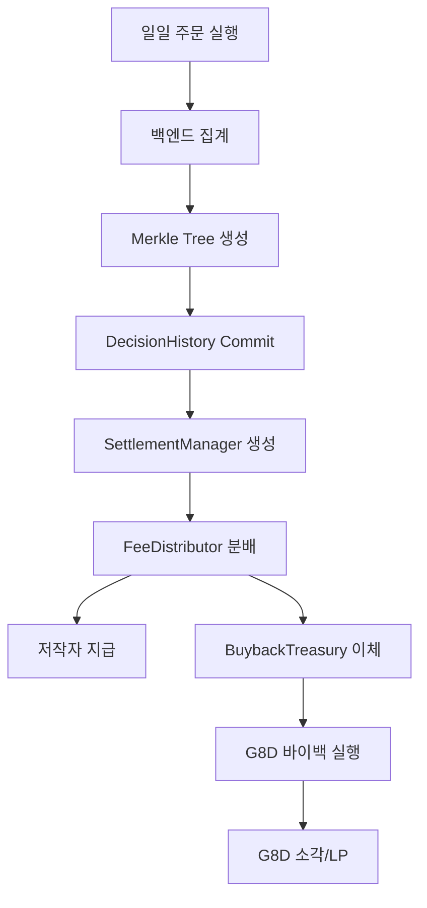

# 정산 시스템 (Settlement System)

Great DIY 프로토콜의 수수료 정산 및 분배 시스템 상세 명세입니다.

---

## 1. 개요

### 1.1 정란 시스템 흐름



### 1.2 정산 단위

| 단위 | 설명 |
|------|------|
| **기본 단위** | (user, strategyId, dayIndex) |
| **dayIndex** | Unix timestamp / 86400 (일자 단위) |
| **통화** | USDT0 (Monad L1) |

---

## 2. 환경별 설정

### 2.1 개발서버 (Development)

```typescript
// config/development.ts
export const developmentConfig = {
  chain: {
    // Monad Testnet
    chainId: 43113,
    name: "Monad Testnet",
    rpcUrls: ["https://testnet-rpc.monad.xyz"],
    blockExplorer: "https://testnet.monad.xyz",
  },
  auth: {
    // 가입 승인제 (MANUAL_APPROVAL)
    registrationMode: "MANUAL_APPROVAL",
    requireAdminApproval: true,
  },
  trading: {
    // 시뮬레이션 모드 (실거래 X)
    mode: "SIMULATION",
    executionType: "PAPER_TRADING",  // 가상 거래
  },
  settlement: {
    // 테스트를 위해 더 짧은 윈도우
    settlementWindow: 1 hours,
    expiryPeriod: 1 days,
  },
  fees: {
    // 테스트를 위해 낮은 수수료
    baseFeeBps: 100,  // 0.01%
    platformFeeBps: 50,
    buybackFeeBps: 25,
  },
};
```

### 2.2 운영서버 (Production)

```typescript
// config/production.ts
export const productionConfig = {
  chain: {
    // Monad Mainnet
    chainId: 43114,
    name: "Monad Mainnet",
    rpcUrls: ["https://rpc.monad.xyz"],
    blockExplorer: "https://explorer.monad.xyz",
  },
  auth: {
    // 공개 가입 (PUBLIC)
    registrationMode: "PUBLIC",
    requireAdminApproval: false,
  },
  trading: {
    // 실거래 모드
    mode: "REAL_TRADING",
    executionType: "LIVE_TRADING",  // 실제 거래
  },
  settlement: {
    settlementWindow: 1 days,
    expiryPeriod: 7 days,
  },
  fees: {
    baseFeeBps: 200,  // 0.2%
    platformFeeBps: 100,  // 0.1%
    buybackFeeBps: 50,   // 0.05%
  },
};
```

### 2.3 환경별 Switching 로직

```typescript
// lib/config.ts
import { developmentConfig, productionConfig } from "@/config";

const isDevelopment = process.env.NODE_ENV === "development";
const isProduction = process.env.NODE_ENV === "production";

export const config = isProduction ? productionConfig : developmentConfig;

// 런타임 환경 확인
export function getRuntimeConfig() {
  const env = process.env.NEXT_PUBLIC_APP_ENV || "development";

  if (env === "production") {
    return productionConfig;
  }
  return developmentConfig;
}
```

---

## 3. 일일 정산 프로세스

### 3.1 정산 준비 (백엔드)

```python
# services/settlement/preparation.py
from datetime import datetime, timedelta
from typing import List, Dict
from decimal import Decimal

class SettlementPreparation:
    """정산 준비 서비스"""

    async def prepare_daily_settlement(
        self,
        strategy_id: int,
        day_index: int
    ) -> Dict:
        """
        일일 정산 데이터 준비

        Args:
            strategy_id: 전략 ID
            day_index: 일자 인덱스

        Returns:
            {
                'orders': 주문 목록,
                'total_volume': 총 거래량,
                'user_fees': 사용자별 수수료,
                'merkle_tree': Merkle Tree
            }
        """
        # 1. 해당 일자의 주문 조회
        start_time = day_index * 86400
        end_time = (day_index + 1) * 86400

        orders = await self.order_repository.get_orders_by_date_range(
            strategy_id=strategy_id,
            start_time=start_time,
            end_time=end_time
        )

        if not orders:
            return None

        # 2. 사용자별 집계
        user_fees = {}
        total_volume = Decimal('0')

        for order in orders:
            user_id = order.user_id
            volume = Decimal(str(order.volume))

            # Tier 조회
            tier = await self.staking_service.get_user_tier(user_id)
            author_tier = await self.staking_service.get_user_tier(order.author_id)

            # 수수료 계산
            fee = await self.calculate_fee(
                volume=volume,
                user_tier=tier,
                author_tier=author_tier
            )

            if user_id not in user_fees:
                user_fees[user_id] = {
                    'total_volume': Decimal('0'),
                    'fee_amount': Decimal('0'),
                    'discount_bps': 0,
                    'user_tier': tier,
                    'author_tier': author_tier
                }

            user_fees[user_id]['total_volume'] += volume
            user_fees[user_id]['fee_amount'] += fee
            user_fees[user_id]['discount_bps'] = self.get_discount_bps(tier)
            total_volume += volume

        # 3. Merkle Tree 생성
        from services.merkle import MerkleTree
        merkle_tree = MerkleTree(orders)

        return {
            'orders': orders,
            'total_volume': total_volume,
            'user_fees': user_fees,
            'merkle_tree': merkle_tree,
            'order_count': len(orders)
        }
```

### 3.2 수수료 계산

```python
# services/settlement/fee_calculator.py
from decimal import Decimal
from typing import Tuple

class FeeCalculator:
    """수수료 계산기"""

    # 환경별 설정 로드
    def __init__(self, config: dict):
        self.base_fee_bps = config['fees']['baseFeeBps']
        self.platform_fee_bps = config['fees']['platformFeeBps']
        self.buyback_fee_bps = config['fees']['buybackFeeBps']
        self.base_author_fee_bps = 1000  # 10%

        # Tier 할인율
        self.tier_discounts = [0, 20, 40, 60, 80, 100]  # bps
        self.tier_author_boosts = [0, 50, 100, 250, 500, 1000]  # bps

    async def calculate_fee(
        self,
        volume: Decimal,
        user_tier: int,
        author_tier: int
    ) -> Decimal:
        """
        수수료 계산

        Args:
            volume: 주문 금액
            user_tier: 사용자 Tier (0-5)
            author_tier: 저작자 Tier (0-5)

        Returns:
            최종 수수료 (USDT0)
        """
        # 1. 기본 수수료
        base_fee = volume * Decimal(self.base_fee_bps) / 10000

        # 2. Tier 할인
        discount_bps = self.tier_discounts[user_tier]
        discounted_fee = base_fee * (10000 - discount_bps) / 10000

        return discounted_fee

    def get_discount_bps(self, tier: int) -> int:
        """Tier별 할인율 반환"""
        return self.tier_discounts[tier] if tier < 6 else 0

    def calculate_author_fee_share(
        self,
        fee_amount: Decimal,
        author_tier: int
    ) -> Decimal:
        """
        저작자 몫 계산

        Args:
            fee_amount: 최종 수수료
            author_tier: 저작자 Tier

        Returns:
            저작자 지급액
        """
        # 기본 저작료 비율 + Tier Boost
        author_fee_bps = self.base_author_fee_bps + self.tier_author_boosts[author_tier]

        return fee_amount * author_fee_bps / 10000

    def calculate_distribution(
        self,
        total_fees: Decimal
    ) -> Tuple[Decimal, Decimal, Decimal]:
        """
        수수료 분배 계산

        Returns:
            (platform_fee, buyback_fee, author_fee)
        """
        platform_fee = total_fees * self.platform_fee_bps / 10000
        buyback_fee = total_fees * self.buyback_fee_bps / 10000
        author_fee = total_fees - platform_fee - buyback_fee

        return platform_fee, buyback_fee, author_fee
```

### 3.3 온체인 커밋

```python
# services/settlement/onchain_commit.py
from web3 import Web3
from typing import Dict

class OnchainCommitService:
    """온체인 커밋 서비스"""

    def __init__(self, web3: Web3, config: dict):
        self.web3 = web3
        self.config = config

        # 컨트랙트 주소 (환경별)
        self.decision_history_address = config['contracts']['decision_history']
        self.settlement_manager_address = config['contracts']['settlement_manager']
        self.fee_distributor_address = config['contracts']['fee_distributor']

    async def commit_decision_history(
        self,
        strategy_id: int,
        day_index: int,
        merkle_root: str,
        batch_info: Dict
    ) -> str:
        """
        DecisionHistory에 Merkle Root 커밋

        Returns:
            트랜잭션 해시
        """
        # ABI 로드
        abi = self.load_abi('DecisionHistory')
        contract = self.web3.eth.contract(
            address=self.decision_history_address,
            abi=abi
        )

        # 커밋 실행 (BACKEND_RELAYER 권한)
        tx_hash = contract.functions.commitDay(
            strategy_id,
            day_index,
            Web3.to_bytes(hexstr=merkle_root),
            (
                batch_info['order_count'],
                int(batch_info['total_volume'] * 1e18),
                0  # avgPrice (선택)
            )
        ).transact({'from': self.backend_relayer})

        receipt = self.web3.eth.wait_for_transaction_receipt(tx_hash)
        return receipt['transactionHash'].hex()

    async def create_settlements(
        self,
        strategy_id: int,
        day_index: int,
        user_fees: Dict
    ) -> list[str]:
        """
        SettlementManager에 정산 생성

        Returns:
            생성된 settlement ID 리스트
        """
        abi = self.load_abi('SettlementManager')
        contract = self.web3.eth.contract(
            address=self.settlement_manager_address,
            abi=abi
        )

        settlement_ids = []

        for user_id, fee_data in user_fees.items():
            # 정산 생성
            tx_hash = contract.functions.createSettlement(
                user_id,  # address
                strategy_id,
                day_index,
                int(fee_data['fee_amount'] * 1e18),  # USDT0 (18 decimals)
                fee_data['discount_bps'],
                fee_data['user_tier'],
                fee_data['author_tier']
            ).transact({'from': self.backend_relayer})

            receipt = self.web3.eth.wait_for_transaction_receipt(tx_hash)

            # 이벤트에서 settlementId 추출
            logs = contract.events.SettlementCreated().process_receipt(receipt)
            if logs:
                settlement_ids.append(logs[0]['args']['settlementId'])

        return settlement_ids

    async def distribute_fees(
        self,
        day_index: int,
        total_fees: Decimal,
        author_fees: Dict
    ) -> str:
        """
        FeeDistributor에 수수료 분배

        Returns:
            트랜잭션 해시
        """
        abi = self.load_abi('FeeDistributor')
        contract = self.web3.eth.contract(
            address=self.fee_distributor_address,
            abi=abi
        )

        # 데이터 준비
        strategy_ids = list(author_fees.keys())
        authors = list(author_fees.values())
        amounts = [int(fee * 1e18) for fee in author_fees.values()]

        # 분배 실행
        tx_hash = contract.functions.distributeDailyFees(
            day_index,
            int(total_fees * 1e18),
            strategy_ids,
            authors,
            amounts
        ).transact({'from': self.backend_relayer})

        receipt = self.web3.eth.wait_for_transaction_receipt(tx_hash)
        return receipt['transactionHash'].hex()
```

---

## 4. 정산 실행 Flow

### 4.1 전체 파이프라인

```python
# services/settlement/pipeline.py
from services.settlement.preparation import SettlementPreparation
from services.settlement.fee_calculator import FeeCalculator
from services.settlement.onchain_commit import OnchainCommitService

class SettlementPipeline:
    """정산 실행 파이프라인"""

    def __init__(self, config: dict, web3: Web3):
        self.config = config
        self.preparation = SettlementPreparation()
        self.calculator = FeeCalculator(config)
        self.commit_service = OnchainCommitService(web3, config)

    async def run_daily_settlement(
        self,
        strategy_id: int,
        day_index: int
    ) -> Dict:
        """
        일일 정산 실행

        Flow:
        1. 오프체인 주문 집계
        2. Merkle Tree 생성
        3. DecisionHistory 커밋
        4. SettlementManager 생성
        5. FeeDistributor 분배
        """
        # 1. 준비
        preparation = await self.preparation.prepare_daily_settlement(
            strategy_id, day_index
        )

        if not preparation:
            return {'status': 'no_orders'}

        # 2. Merkle Root 커밋
        commit_tx = await self.commit_service.commit_decision_history(
            strategy_id,
            day_index,
            preparation['merkle_tree'].root,
            {
                'order_count': preparation['order_count'],
                'total_volume': preparation['total_volume']
            }
        )

        # 3. 정산 생성
        settlement_ids = await self.commit_service.create_settlements(
            strategy_id,
            day_index,
            preparation['user_fees']
        )

        # 4. 총 수수료 계산
        total_fees = sum(
            fee_data['fee_amount']
            for fee_data in preparation['user_fees'].values()
        )

        # 5. 수수료 분배
        distribute_tx = await self.commit_service.distribute_fees(
            day_index,
            total_fees,
            preparation['user_fees']
        )

        return {
            'status': 'success',
            'commit_tx': commit_tx,
            'settlement_ids': settlement_ids,
            'distribute_tx': distribute_tx,
            'total_fees': str(total_fees),
            'order_count': preparation['order_count']
        }
```

### 4.2 스케줄러 (Cron Job)

```python
# services/settlement/scheduler.py
from apscheduler.schedulers.asyncio import AsyncIOScheduler
from datetime import datetime

class SettlementScheduler:
    """정산 스케줄러"""

    def __init__(self, pipeline: SettlementPipeline):
        self.pipeline = pipeline
        self.scheduler = AsyncIOScheduler()

    async def run_settlement_task(self, strategy_id: int):
        """스케줄된 정산 태스크"""
        # 어제 날짜
        yesterday = datetime.utcnow() - timedelta(days=1)
        day_index = int(yesterday.timestamp() // 86400)

        try:
            result = await self.pipeline.run_daily_settlement(
                strategy_id, day_index
            )

            if result['status'] == 'success':
                logger.info(
                    f"Settlement completed for strategy {strategy_id}: "
                    f"{result['order_count']} orders, "
                    f"{result['total_fees']} USDT0"
                )
        except Exception as e:
            logger.error(f"Settlement failed for strategy {strategy_id}: {e}")

    def start(self):
        """스케줄러 시작 (매일 새벽 1시 실행)"""
        self.scheduler.add_job(
            self.run_settlement_task,
            'cron',
            hour=1,
            minute=0,
            args=[1]  # strategy_id (실제로는 활성화된 전략 모두)
        )
        self.scheduler.start()
```

---

## 5. 사용자 정산 조회

### 5.1 온체인 조회

```typescript
// hooks/useSettlement.ts
"use client";

import { useReadContract } from "thirdweb/react";
import { settlementManagerContract } from "@/lib/contracts";
import { encodeAbiParameters } from "thirdweb/utils";

export function useSettlement(
  user: string,
  strategyId: bigint,
  dayIndex: bigint
) {
  const { data, isLoading } = useReadContract({
    contract: settlementManagerContract,
    method: "getSettlementByIds",
    params: [
      user as `0x${string}`,
      strategyId,
      dayIndex
    ],
  });

  return {
    settlement: data,
    isLoading,
  };
}

// 사용자의 미지급 정산금
export function useUnpaidAmount(user: string) {
  const { data } = useReadContract({
    contract: settlementManagerContract,
    method: "getUnpaidAmount",
    params: [user as `0x${string}`],
  });

  return {
    unpaidAmount: data || 0n,
  };
}
```

### 5.2 정산 지급

```typescript
// hooks/usePaySettlement.ts
"use client";

import { useSendTransaction } from "thirdweb/react";
import { settlementManagerContract } from "@/lib/contracts";
import { prepareContractCall } from "thirdweb";

export function usePaySettlement() {
  const { mutateAsync: sendTransaction } = useSendTransaction();

  const paySettlement = async (settlementId: bigint) => {
    const transaction = prepareContractCall({
      contract: settlementManagerContract,
      method: "paySettlement",
      params: [settlementId],
    });

    return await sendTransaction(transaction);
  };

  return { paySettlement };
}
```

---

## 6. 저작자 수수료 조회

### 6.1 누적 수수료

```typescript
// hooks/useAuthorFees.ts
"use client";

import { useReadContract } from "thirdweb/react";
import { feeDistributorContract } from "@/lib/contracts";

export function useAuthorAccumulatedFees(
  strategyId: bigint,
  author: string
) {
  const { data } = useReadContract({
    contract: feeDistributorContract,
    method: "getAuthorAccumulatedFees",
    params: [strategyId, author as `0x${string}`],
  });

  return {
    accumulatedFees: data || 0n,
  };
}
```

### 6.2 저작자 출금

```typescript
// hooks/useWithdrawAuthorFees.ts
"use client";

import { useSendTransaction } from "thirdweb/react";
import { feeDistributorContract } from "@/lib/contracts";
import { prepareContractCall } from "thirdweb";

export function useWithdrawAuthorFees() {
  const { mutateAsync: sendTransaction } = useSendTransaction();

  const withdraw = async (strategyId: bigint, amount: bigint) => {
    const transaction = prepareContractCall({
      contract: feeDistributorContract,
      method: "withdrawAuthorFees",
      params: [strategyId, amount],
    });

    return await sendTransaction(transaction);
  };

  return { withdraw };
}
```

---

## 7. 환경별 컨트랙트 주소 관리

### 7.1 주소 설정 파일

```typescript
// config/contracts.ts
export const CONTRACT_ADDRESSES = {
  development: {
    decisionHistory: "0x...",
    settlementManager: "0x...",
    feeDistributor: "0x...",
    buybackTreasury: "0x...",
    g8dToken: "0x...",
    g8dStaking: "0x...",
    strategyRegistry: "0x...",
    followRegistry: "0x...",
  },
  production: {
    decisionHistory: "0x...",
    settlementManager: "0x...",
    feeDistributor: "0x...",
    buybackTreasury: "0x...",
    g8dToken: "0x...",
    g8dStaking: "0x...",
    strategyRegistry: "0x...",
    followRegistry: "0x...",
  },
} as const;

export function getContractAddresses() {
  const env = process.env.NEXT_PUBLIC_APP_ENV || "development";
  return CONTRACT_ADDRESSES[env as keyof typeof CONTRACT_ADDRESSES];
}
```

### 7.2 컨트랙트 인스턴스 생성

```typescript
// lib/contracts.ts
import { getContract } from "thirdweb";
import { thirdwebClient, monad } from "./thirdweb";
import { getContractAddresses } from "@/config/contracts";

const addresses = getContractAddresses();

export const decisionHistoryContract = getContract({
  client: thirdwebClient,
  chain: monad,
  address: addresses.decisionHistory,
});

export const settlementManagerContract = getContract({
  client: thirdwebClient,
  chain: monad,
  address: addresses.settlementManager,
});

export const feeDistributorContract = getContract({
  client: thirdwebClient,
  chain: monad,
  address: addresses.feeDistributor,
});

// ... 기타 컨트랙트
```

---

## 8. API 엔드포인트

### 8.1 정산 관련 API

```python
# api/v1/settlement.py
from fastapi import APIRouter, Depends
from sqlalchemy.ext.asyncio import AsyncSession

router = APIRouter(prefix="/settlement", tags=["settlement"])

@router.get("/my-settlements")
async def get_my_settlements(
    current_user: User = Depends(get_current_user),
    db: AsyncSession = Depends(get_db)
):
    """
    내 정산 내역 조회
    """
    settlements = await settlement_service.get_user_settlements(
        user_id=current_user.id,
        db=db
    )
    return {"settlements": settlements}

@router.get("/unpaid-amount")
async def get_unpaid_amount(
    current_user: User = Depends(get_current_user),
    db: AsyncSession = Depends(get_db)
):
    """
    미지급 정산금 조회
    """
    amount = await settlement_service.get_unpaid_amount(
        user_id=current_user.id,
        db=db
    )
    return {"unpaid_amount": amount}

@router.post("/pay/{settlement_id}")
async def pay_settlement(
    settlement_id: str,
    current_user: User = Depends(get_current_user),
    db: AsyncSession = Depends(get_db)
):
    """
    정산 지급 실행 (온체인 트랜잭션)
    """
    result = await settlement_service.pay_settlement(
        settlement_id=settlement_id,
        user_id=current_user.id,
        db=db
    )
    return result

# 저작자 전용
@router.get("/author/accumulated-fees")
async def get_author_fees(
    strategy_id: int,
    current_user: User = Depends(get_current_user),
    db: AsyncSession = Depends(get_db)
):
    """
    저작자 누적 수수료 조회
    """
    fees = await settlement_service.get_author_accumulated_fees(
        strategy_id=strategy_id,
        author_id=current_user.id,
        db=db
    )
    return {"accumulated_fees": fees}

@router.post("/author/withdraw")
async def withdraw_author_fees(
    strategy_id: int,
    amount: float,
    current_user: User = Depends(get_current_user),
    db: AsyncSession = Depends(get_db)
):
    """
    저작자 수수료 출금
    """
    result = await settlement_service.withdraw_author_fees(
        strategy_id=strategy_id,
        amount=amount,
        author_id=current_user.id,
        db=db
    )
    return result
```

---

## 9. 상위/관련 문서

- **[../index.md](../index.md)** - 블록체인 개요
- **[./smart-contracts.md](./smart-contracts.md)** - 스마트 컨트랙트 명세
- **[./web3-integration.md](./web3-integration.md)** - Web3 연동 (thirdweb)
- **[../design/5_수수료 정산 데이터 관리.md](../design/5_수수료 정산 데이터 관리.md)** - 정산 데이터 설계

---

*최종 업데이트: 2025-12-29*
