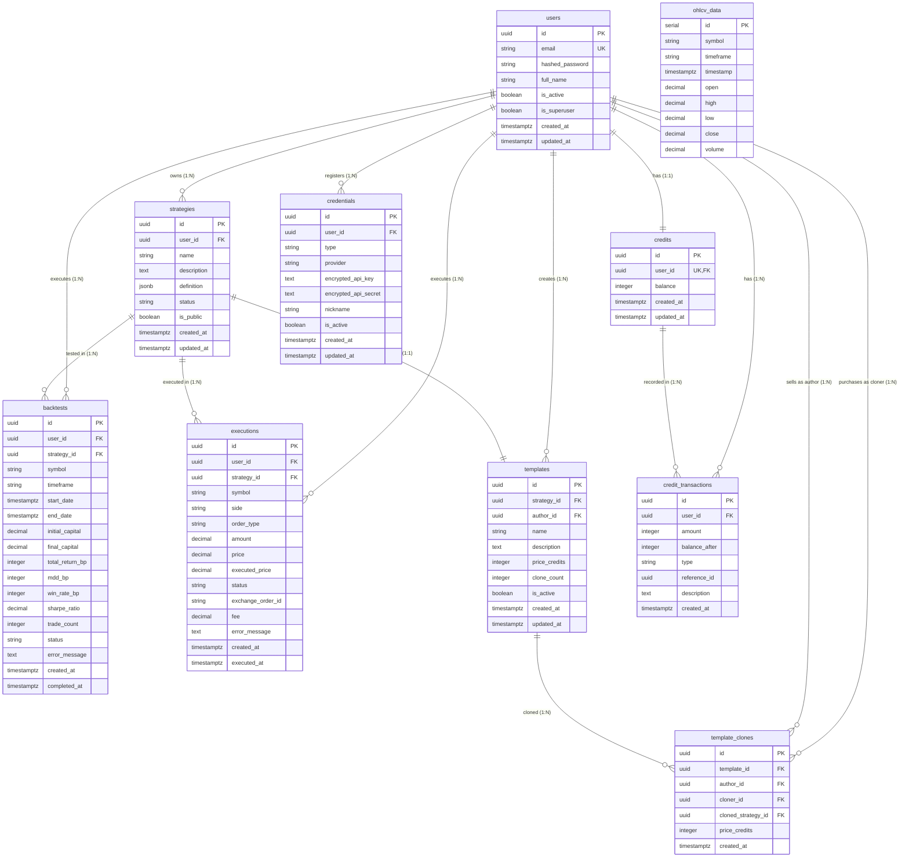

# ERD (Entity Relationship Diagram)

## 1. 전체 ERD

---

## 2. 관계 상세 설명

### 2.1 users (중심 테이블)

| 관계 | 카디널리티 | 설명 |
|------|-----------|------|
| users → strategies | 1:N | 한 사용자는 여러 전략을 보유할 수 있음 |
| users → backtests | 1:N | 한 사용자는 여러 백테스트를 실행할 수 있음 |
| users → executions | 1:N | 한 사용자는 여러 실행을 가질 수 있음 |
| users → credits | 1:1 | 한 사용자는 하나의 크레딧 계정을 가짐 |
| users → credentials | 1:N | 한 사용자는 여러 API 키를 등록할 수 있음 |
| users → templates | 1:N | 한 사용자는 여러 템플릿을 공개할 수 있음 |
| users → credit_transactions | 1:N | 한 사용자는 여러 크레딧 거래 내역을 가짐 |

### 2.2 strategies (전략)

| 관계 | 카디널리티 | 설명 |
|------|-----------|------|
| strategies → backtests | 1:N | 한 전략은 여러 백테스트를 가질 수 있음 |
| strategies → executions | 1:N | 한 전략은 여러 실행을 가질 수 있음 |
| strategies → templates | 1:1 | 한 전략은 하나의 템플릿으로 공개될 수 있음 |

### 2.3 templates (템플릿)

| 관계 | 카디널리티 | 설명 |
|------|-----------|------|
| templates → template_clones | 1:N | 한 템플릿은 여러 번 복제될 수 있음 |

### 2.4 credits (크레딧)

| 관계 | 카디널리티 | 설명 |
|------|-----------|------|
| credits → credit_transactions | 1:N | 한 크레딧 계정은 여러 거래 내역을 가짐 |

---

## 3. CASCADE 삭제 규칙

| 부모 테이블 | 자식 테이블 | 삭제 동작 |
|-----------|-----------|---------|
| users | strategies | CASCADE |
| users | credits | CASCADE |
| users | credentials | CASCADE |
| users | templates | CASCADE |
| strategies | templates | CASCADE |
| strategies | backtests | CASCADE |
| strategies | executions | CASCADE |

**참고**: backtests, executions, credit_transactions, template_clones은 `ON DELETE RESTRICT` 또는 `ON DELETE SET NULL`로 설계하여 **히스토리 보존** (삭제된 사용자/전략의 데이터라도 백테스트 결과는 유지)

---

## 4. UNIQUE 제약조건

| 테이블 | 컬럼 | 설명 |
|-------|------|------|
| users | email | 이메일 중복 가입 방지 |
| credits | user_id | 한 사용자당 하나의 크레딧 계정 |
| ohlcv_data | (symbol, timeframe, timestamp) | 중복 데이터 방지 |

---

## 5. 인덱스 요약

| 테이블 | 인덱스 | 용도 |
|-------|-------|------|
| users | email | 로그인 조회 |
| strategies | user_id, status, is_public | 사용자 전략 조회, 필터링 |
| backtests | user_id, strategy_id, status | 조회, 필터링 |
| executions | user_id, strategy_id, status | 조회, 필터링 |
| templates | author_id, is_active | 공개 템플릿 조회 |
| template_clones | template_id, author_id, cloner_id | 조회, 통계 |
| credits | user_id | 크레딧 잔액 조회 |
| credit_transactions | user_id, type, created_at | 거래 내역 조회 |
| credentials | user_id, type | API 키 조회 |
| ohlcv_data | (symbol, timeframe, timestamp), timestamp | 시계열 데이터 조회 |

---

## 6. 상위/관련 문서

- **[../index.md](../index.md)** - 데이터 모델 개요
- **[table-schemas.md](./table-schemas.md)** - 테이블별 상세 스키마
- **[constraints.md](./constraints.md)** - 제약조건 상세
- **[indexes.md](./indexes.md)** - 인덱스 설계 상세

---

*최종 업데이트: 2025-12-29*
